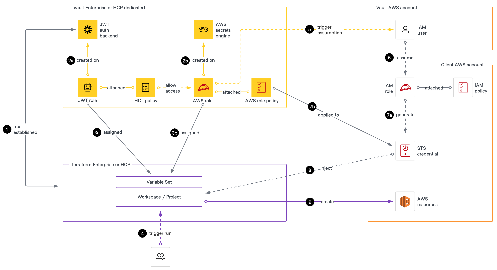
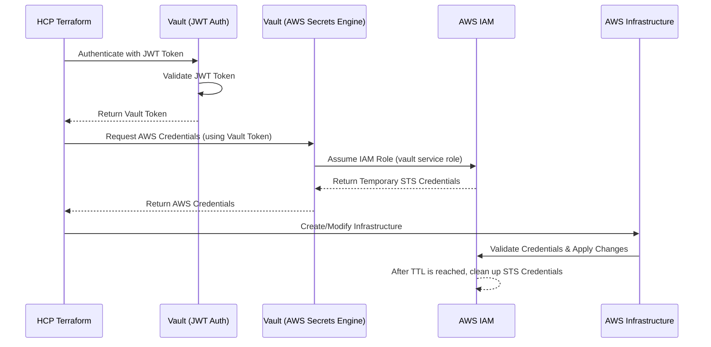

| HashiCorp Products | Terraform Enterprise (TFE), HCP Terraform (HCP TF), Vault Enterprise, HCP Vault Dedicated |
|:---|:---|
| Partner Products | N/A |
| Maturity | Standardize |
| Use Case Coverage | Vault-backed dynamic credentials for the AWS provider |
| Environment | All |
| Tags | Vault, HCP Terraform, Terraform, Enterprise, Vault HCP, HCP |
| Publish / Updated Date | March 15, 2025, Version 1.0.0 |
| Authors | Alex Soldatchenko |

# HCP Terraform Vault-backed dynamic credentials for the AWS provider

## Purpose of this guide

This pattern addresses common challenges in managing AWS credentials, offering improved security, scalability, and operational efficiency. By integrating Vault-backed dynamic credentials with HCP Terraform, platform teams can focus on delivering secure, automated infrastructure without reinventing the wheel.

- **Enhanced Security**: Eliminate static credentials with short-lived, scoped AWS credentials managed by Vault.
- **Simplified Management**: Centralize and automate credential issuance, rotation, and revocation across multiple AWS accounts.
- **Operational Efficiency**: Seamlessly integrate dynamic credentials into Terraform workflows, reducing manual overhead.
- **Scalability:** Pre-built Terraform modules standardize the onboarding of AWS accounts, Terraform projects, and workspaces, reducing setup complexity as the environment grows.
- **Compliance**: Gain auditability and enforce fine-grained access policies to meet regulatory requirements.

For more on the value of Vault-backed dynamic credentials, see this [HashiCorp article](https://www.hashicorp.com/blog/why-use-vault-backed-dynamic-credentials-to-secure-hcp-terraform-infrastructure).

## Architecture diagram



### Summary of architecture

This architecture demonstrates how HCP Terraform integrates with Vault to dynamically inject short-lived AWS credentials into Terraform workflows. The components interact as follows:

1. Trust is established between TFC and Vault's JWT authentication backend. This allows TFC workspaces to authenticate securely using workload identity tokens.
2. Roles created
   - **a.** A JWT role is created on the Vault JWT auth backend. This role serves as the workload identity of the TFC workspace and has a Vault policy attached to permit access to the specific AWS Secrets Engine role that generates the STS credentials.
   - **b.** An AWS Secrets Engine role is created in the Vault AWS Secrets Engine using the assumed_role type. This role includes a Vault-defined AWS IAM policy that determines the permissions of the generated STS credentials after Vault's AWS IAM user assumes the AWS IAM role (vault service role). The total permissions are the intersection of the Vault policy and the AWS IAM role policies.
3. Roles assigned
   - **a.** The JWT role is assigned to the HCPT workspace or project using a variable set. This assignment allows either:
     - A workspace to authenticate with Vault during a run
     - A set of workspaces nested under a project to authenticate with Vault during their runs
   - **b.** The AWS Secrets Engine role, along with other required environment variables, is also assigned to the workspace to enable dynamic credential injection.
1. A user or system triggers a Terraform run in the TFC workspace.
2. Terraform requests credentials from Vault using its JWT workload identity. Vault's AWS Secrets Engine then triggers an STS assumption using its AWS IAM user.
3. Vault assumes the AWS IAM role (vault service role) in the target AWS account using its IAM user.
7. STS credentials
   - **a.** STS credentials are generated by Vault based on the effective permissions defined by both the Vault AWS Secrets Engine role and the AWS IAM role.
   - **b.** The generated STS credentials are scoped to the intersection of the permissions defined by the Vault AWS Secrets Engine role and the AWS IAM role.
1. The STS credentials are injected into the TFC workspace and used by the AWS provider during the Terraform run.
2. The Terraform run executes using the injected credentials to create and manage AWS resources in the target (client) account. Once the STS credentials expire, AWS automatically cleans them up when the STS timeout is reached.

### Sequence diagram



### Codebase Overview

The repository is structured to provide pre-built modules and examples for provisioning, configuring, and consuming Vault-backed dynamic credentials. Below is a high-level view of its structure and purpose:

```
├── module-provisioning-examples
│   ├── 1. prerequisites
│   ├── 2. aws-account-onboarding
│   └── 3. tfe-project-workspace-onboarding
├── modules
│   ├── terraform-aws-vault-dynamic-secrets-prereqs
│   ├── terraform-tfe-vault-dynamic-creds-onboarding
│   ├── terraform-tfe-vault-dynamic-creds-variables
│   ├── terraform-vault-aws-account-onboarding
│   └── terraform-vault-jwt-tfe-identity
├── provider-usage-examples
│   ├── multi-aws-account-provider-configs
│   └── single-aws-account-provider-configs
```

### Module Provisioning Examples

The `module-provisioning-examples` directory contains codified templates demonstrating how to call and pass variables to the modules. These examples provide a step-by-step implementation of the pattern and should be followed in the correct order:

1. **Prerequisites** sets up foundational resources by calling:
     - **`terraform-aws-vault-dynamic-secrets-prereqs`**: Configures Vault AWS Secrets Engine, IAM user, and JWT authentication backend.
2. **AWS Account Onboarding** onboards target AWS accounts into Vault by calling:
     - **`terraform-vault-aws-account-onboarding`**: Onboards AWS accounts by creating IAM roles, Vault roles, and policies.
3. **TFC Project/Workspace Onboarding** configures HCP Terraform workspaces by calling:
     - **`terraform-tfe-vault-dynamic-creds-onboarding`**: Integrates Vault with TFC, including workload identity and dynamic credential injection.
      - **`terraform-tfe-vault-dynamic-creds-variables`**: Manages TFC environment variables required for Vault integration.
      - **`terraform-vault-jwt-tfe-identity`**: Sets up JWT authentication for TFC to authenticate with Vault.

Each module includes a detailed README and an `example` directory with sample configurations. Use these examples to understand how the modules should be called and parameterized.

### Provider Usage Examples

The `provider-usage-examples` directory is the final step for consumers of TFC. It demonstrates how end users can configure their Terraform code to leverage the injected dynamic credentials.

- **Single AWS Account Provider Configs**: shows how to configure a default AWS provider and aliased providers within a single AWS account.
- **Multi-AWS Account Provider Configs**: demonstrates how to configure AWS providers for multiple accounts using dynamic credentials.

These examples are designed for TFC customers who consume the pattern. Ensure platform teams educate users on these configurations to maximize adoption and proper use of dynamic credentials.

## Checklist

Before starting the implementation of this pattern, use this checklist to ensure you have all the necessary resources and permissions to execute the steps effectively.

### Repository and Environment Setup
- Clone the repository containing this pattern to your local machine.
- Create a dedicated local directory to organize your Terraform code. Use the examples in the `module-provisioning-examples` directory as starting points.

### Confirm Permissions in Vault
- The ability to configure the AWS Secrets Engine.
- The ability to enable and configure the JWT authentication backend.
- Access to create and assign policies to AWS roles in Vault.

### Confirm Permissions in AWS
- Create IAM roles, policies, and users in the AWS accounts.
- Allow Vault to assume IAM roles in the target AWS accounts.

### Prepare AWS Accounts
- Vault AWS Account: Hosts the Vault IAM user and AWS Secrets Engine configuration.
- Target AWS Account(s): Onboard one or more AWS accounts to be dynamic credential "ready" for Terraform runs.

> [!TIP]
> While the pattern can work with two accounts, using three accounts enables a more thorough validation of multi-account functionality.

### Configure HCP Terraform
- A TFC workspace is configured to consume Vault-backed dynamic credentials.
- A TFC project is configured with one or more workspaces assigned under it.

### Terraform Setup
- Ensure access to a self-hosted Terraform Enterprise instance or an HCP Terraform organization.
- Configure the Terraform CLI and workspace environment to securely manage Terraform state, especially when using remote backends.

### Tooling
- Terraform CLI (latest version recommended).
- AWS CLI (configured with appropriate credentials and access to the AWS accounts).
- Vault CLI (for testing and verifying Vault configuration).

## Workflows

The deployment of this pattern follows a structured approach to ensure secure, scalable, and automated credential management.

1. Provision Vault and AWS prerequisites to establish the foundation for dynamic credentials. The AWS Secrets Engine and JWT authentication backend are configured in Vault, and required IAM roles and policies are created in AWS. These components enable Vault to securely assume AWS IAM roles and generate short-lived STS credentials.
2. Onboard AWS accounts into Vault to enable dynamic credential issuance. AWS IAM roles, policies, and Vault Secrets Engine roles are created to allow scoped access to resources. This ensures that AWS accounts are properly configured to support ephemeral credentials managed by Vault.
3. Configure HCP Terraform workspaces to authenticate with Vault and retrieve dynamic credentials. Workload identity is enabled in Terraform workspaces, allowing them to request AWS credentials dynamically. Vault roles and policies are assigned to enforce least-privilege access and ensure credentials are scoped appropriately.
4. Update Terraform AWS provider configurations to consume injected credentials. Terraform configurations are modified to use dynamic credentials instead of static IAM keys. This eliminates long-lived secrets while maintaining seamless ability to deploy AWS resources.

## Steps

### Step 1: Deploy prerequisites

**Task:** Configure the Vault AWS Secrets Engine and enable the HCP Terraform JWT authentication backend.

**Persona:** Vault Platform Team

To enable Vault-backed dynamic credentials, the foundational components must first be provisioned. The key module for this step is `terraform-aws-vault-dynamic-secrets-prereqs`, which establishes the necessary AWS and Vault configurations for secure credential management. This module is responsible for:

- Creating an AWS IAM user with the required permissions for Vault integration.
- Configuring the AWS Secrets Engine in Vault to generate short-lived credentials dynamically.
- Setting up JWT authentication in Vault to allow TFC to authenticate securely.

Reference the `/module-provisioning-examples/1. prerequisites/` directory for an example of how to call this module. Copy the example configuration and make the necessary adjustments based on your specific environment. The full set of inputs can be seen in the `/modules/terraform-aws-vault-dynamic-secrets-prereqs/example` directory.

> [!IMPORTANT]
> This module provisions an AWS IAM user, IAM policies, Vault secrets engines, and authentication mounts. Ensure that this module is deployed with least-privilege AWS and Vault credentials to minimize security risks.

#### Module Inputs and Considerations

```hcl
external_id                = "01931d16-aa6e-7b2e-8678-f1757c144041"

aws_secrets_backend_tune_settings = {
  default_lease_ttl_seconds = 3600
  max_lease_ttl_seconds     = 7200
}

jwt_backend_tune_settings = {
  default_lease_ttl = "1h"
  max_lease_ttl     = "2h"
}
```

- The `external_id` value must remain consistent across all future steps. It is a critical security control that mitigates the **Confused Deputy Problem**, ensuring that only the intended entity can assume an IAM role.
- The **default and max lease TTLs** define how long AWS STS credentials and JWT tokens remain valid. Proper alignment is necessary to avoid credential expiration during Terraform runs.

**AWS Secrets Engine TTLs**
  - `default_lease_ttl_seconds = 3600` (1 hour): The default duration for AWS credentials issued by Vault.
  - `max_lease_ttl_seconds = 7200` (2 hours): The maximum allowed duration before credentials expire.
  - Ensure that Terraform runs are not longer than the AWS credentials’ TTL. Long-running executions may fail due to expired credentials.

**JWT Backend TTLs**
  - `default_lease_ttl = "1h"`: The default time-to-live for JWT tokens used by TFC.
  - `max_lease_ttl = "2h"`: The longest duration a token can remain valid.
  - JWT token expiration should align with the AWS Secrets Engine TTLs. If the JWT expires before AWS credentials, Terraform runs could lose access mid-execution.

#### What is Provisioned in AWS and Vault

After successfully provisioning this module, the following resources should be created:

**AWS Resources**
- An **IAM user** dedicated for Vault, used by the AWS Secrets Engine to assume roles.
- An **IAM policy** attached to the IAM user, granting permissions to assume specific AWS IAM roles in future steps.
- An **IAM access key** associated with the Vault IAM user (securely stored in Vault, never used directly).

> [!IMPORTANT]
> The Vault AWS Secrets Engine provides the ability to rotate the access keys for the IAM user. This capability ensures the security and longevity of the IAM user credentials. For more information, refer to the [Rotate Root IAM Credentials](https://www.google.com/url?sa=E&source=gmail&q=https://developer.hashicorp.com/vault/api-docs/secret/aws#rotate-root-iam-credentials) documentation. It is **strongly recommended** that automation is configured to rotate the access key based on your organization's security policies. Consider setting up a solution, such as AWS Lambda, to manage access key rotation at a frequency that meets your requirements.

**Vault Resources**
- The **AWS Secrets Engine** enabled at the configured path (`aws-tfc/`), allowing Vault to generate dynamic AWS credentials.
- The **JWT authentication backend** enabled at the configured path (`jwt-tfc/`), allowing TFC to authenticate securely.

### Step 2: Onboard AWS accounts

**Task:** Configure Vault to manage dynamic credentials for onboarded AWS accounts by setting up IAM roles and AWS Secrets Engine roles.

**Persona:** HCP Terraform and AWS Platform Team

With Vault and the AWS Secrets Engine configured, the next step is to onboard AWS accounts to support dynamic credentials. The `terraform-vault-aws-account-onboarding` module is responsible for provisioning the required IAM roles, policies, and Vault AWS Secrets Engine roles. This module ensures that AWS accounts are properly configured for Vault to generate short-lived, scoped AWS credentials for Terraform runs. The module performs the following tasks:

- Creates an IAM role with a trust policy for the Vault service user, allowing Vault to assume the role.
- Configures the IAM role policy, which determines the maximum permissions granted to STS credentials issued by Vault. Supports built-in AWS policies or custom JSON policies for maximum flexibility.
- Defines `vault_aws_secret_backend_role` resources to enable Vault to issue `assumed_role` credentials.
- Supports multiple Vault roles using a `for_each` loop for flexible configuration, enabling the definition of various roles with different permissions.

Reference the `/module-provisioning-examples/2. aws-account-onboarding/` directory for an example of how to call this module. Copy the example configuration and make the necessary adjustments based on your environment. The full set of inputs can be seen in the `/modules/terraform-vault-aws-account-onboarding/example` directory.

Some notable items from the provisioning example:
- `terraform_remote_state` data source used to retrieve the IAM user ARN and AWS backend path created in the previous step.
- Two instances of the `terraform-vault-aws-account-onboarding` module to onboard two AWS accounts.
- Creation of Vault AWS roles using built-in AWS policies (i.e. `AmazonEC2FullAccess`) and custom JSON policies.

> [!IMPORTANT]
> This module provisions IAM roles, policies, and Vault roles. Ensure that the policies are scoped appropriately to prevent over-privileged access.

#### Module Inputs and Considerations

Make sure that the `external_id` value matches the one used in the previous step. This ensures that the IAM roles can only be assumed by the intended entity. In addition to the external ID, there are other important inputs to consider:

```hcl
vault_aws_service_role_config = {
  aws_built_in_policy_name = "AdministratorAccess"
  custom_policy_name       = null
  custom_policy_directory  = null
}
```

The `vault_aws_service_role_config` block defines the IAM role policy configuration for the Vault service role. It allows you to specify either a built-in AWS policy or a custom policy.
  - `aws_built_in_policy_name`: The name of the built-in AWS policy to attach to the IAM role. If using a custom policy, set this to `null`.
  - `custom_policy_name`: The name of the custom policy without the `.json` extension. Set this to `null` if not using a custom policy.
  - `custom_policy_directory`: The directory where the custom policy is stored. Set this to `null` if not using a custom policy.

> [!IMPORTANT]
> The policy applied using `vault_aws_service_role_config` is the policy that's applied to the IAM role that Vault assumes. This policy should be the intersection of the permissions required by the Vault AWS Secrets Engine role and the AWS IAM role. This policy determines the maximum permissions that could granted to the STS credentials issued by Vault.

The module also supports the creation of multiple Vault AWS Secrets Engine roles using the `for_each` loop. This feature allows you to define multiple roles with different permissions and configurations. Built-in AWS policies or custom JSON policies can be used to define the permissions granted to the generated STS credentials. Below are examples of how to define a role using a built-in AWS policy and a custom JSON policy.

Built-in AWS policy example:

```hcl
vault_aws_role_configurations = {
  ec2_instance_provisioner = {
    name                     = "ec2-instance-provisioner"
    tag_suffix               = "EC2_PROV"
    custom_policy_name       = null
    custom_policy_directory  = null
    aws_built_in_policy_name = "AmazonEC2FullAccess" # built-in policy name, set to null if not using built-in policy
    default_sts_ttl          = 3600
    max_sts_ttl              = 7200
  }
}
```

Custom JSON policy example:

```hcl
vault_aws_role_configurations = {
  ec2_instance_provisioner = {
    name                     = "ec2-instance-provisioner"
    tag_suffix               = "EC2_PROV"
    custom_policy_name       = "ec2-full-access" # trim the .json extension, i.e. ec2-full-access.json becomes ec2-full-access
    custom_policy_directory  = "policies"
    aws_built_in_policy_name = null
    default_sts_ttl          = 3600
    max_sts_ttl              = 7200
  }
}
```

> [!WARNING]
> AWS enforces a strict size limit on [session policies](https://docs.aws.amazon.com/transfer/latest/userguide/requirements-roles.html#session-policy). Ensure that the JSON policy passed during the AssumeRole call does not exceed `2048` characters. Policies exceeding this size will result in a validation error during the AssumeRole call.

The module has intentionally structured outputs to provide the necessary information for the next steps. These outputs include the ARN of the IAM role, the ARN of the Vault service user, and the path to the AWS Secrets Engine in Vault. These outputs are used in subsequent steps to configure TFC workspaces and inject dynamic credentials. Below is an example of the outputs provided by the module:

```hcl
# Output example
output "vault_aws_roles_01" {
  description = "The AWS role aliases to be used in the Terraform Cloud Workspace or Project environment variables to support dynamic credentials."
  value       = module.aws_vault_account_onboarding_01.vault_aws_roles
}

# Output structure
vault_aws_roles_01 = {
  "123456789012_TFC_VAULT_BACKED_AWS_RUN_VAULT_ROLE_DB_ADMIN" = {
    "aws_run_role_arn" = "arn:aws:iam::123456789012:role/vault-service-role"
    "tag_suffix"       = "123456789012_DB_ADMIN"
    "vault_role"       = "123456789012-dynamodb-admin"
  }
  "123456789012_TFC_VAULT_BACKED_AWS_RUN_VAULT_ROLE_EC2_PROV" = {
    "aws_run_role_arn" = "arn:aws:iam::123456789012:role/vault-service-role"
    "tag_suffix"       = "123456789012_EC2_PROV"
    "vault_role"       = "123456789012-ec2-instance-provisioner"
  }
  "123456789012_TFC_VAULT_BACKED_AWS_RUN_VAULT_ROLE_S3_ADMIN" = {
    "aws_run_role_arn" = "arn:aws:iam::123456789012:role/vault-service-role"
    "tag_suffix"       = "123456789012_S3_ADMIN"
    "vault_role"       = "123456789012-s3-full-access"
  }
}
```

#### What is provisioned in AWS and Vault

After successfully provisioning this module, the following resources should be created:

**AWS Resources**
- **IAM role (vault service role)** that Vault assumes to generate STS credentials.
- **IAM policy** attached to the vault service role, defining the maximum permissions that can be granted to dynamically issued credentials.
- **IAM trust policy** on the vault service role, restricting assumptions to only the Vault IAM user and enforcing the external ID.
- **Multiple IAM roles (if configured)** for different Terraform use cases, each with scoped permissions.

> [!IMPORTANT]
> The IAM policy attached to the AWS `vault-service-role` IAM role and the Vault AWS Secrets Engine role determine the permissions granted to the STS credentials issued by Vault. The applied policy is at the intersection of the Vault AWS Secrets Engine role and the AWS IAM role policies. These permissions can't exceed the permissions granted by the AWS IAM role (`vault-service-role`).

**Vault Resources**
- **Vault AWS Secrets Engine role(s)** (`vault_aws_secret_backend_role`), mapping Vault roles to AWS IAM roles for dynamic credential issuance.
- **Dynamic credential scoping** based on TTL configurations (`default_sts_ttl`, `max_sts_ttl`), ensuring short-lived, ephemeral credentials.
- **Multiple Vault AWS Secrets Engine roles (if configured)**, allowing differentiated access per Terraform workspace or project.

The successful completion of this step establishes a secure mapping between Vault and AWS IAM, allowing Vault to generate short-lived, scoped credentials dynamically. The next step will configure HCP Terraform workspaces to consume these credentials.

### Step 3: Configure TFC workspaces and projects for dynamic credentials

**Task:** Integrate TFC with Vault to dynamically inject short-lived AWS credentials into Terraform runs.

**Persona:** HCP Terraform and AWS Platform Team

With AWS accounts onboarded and Vault AWS Secrets Engine roles configured, the next step is to configure HCP Terraform workspaces and projects to consume these credentials dynamically. This step ensures that Terraform runs authenticate securely without relying on static IAM credentials.

The `terraform-tfe-vault-dynamic-creds-onboarding` module handles this integration by:
- Assigning the **JWT role and Vault AWS Secrets Engine role(s)** to the specified Terraform workspaces or projects.
- Configuring **TFC workload identity**, enabling the workspace to authenticate with Vault via JWT.
- Injecting **dynamic credentials into Terraform runs**, ensuring each run gets a short-lived, scoped AWS credential.
- Using **variable sets** for scalable and repeatable configuration.

Reference the `/module-provisioning-examples/3. tfe-project-workspace-onboarding/` directory for an example of how to call this module. Copy the example configuration and adjust it based on your environment. The full set of inputs can be seen in the `/modules/terraform-tfe-vault-dynamic-creds-onboarding/example` directory.

> [!IMPORTANT]
> Workspaces using Vault-backed credentials **must not have static AWS IAM credentials stored in TFC environment variables**. Remove any existing AWS provider variables, such as `AWS_ACCESS_KEY_ID` and `AWS_SECRET_ACCESS_KEY`, to prevent conflicts with dynamic credentials.

Some notable items from the provisioning example:
- `terraform_remote_state` data source used to retrieve the Vault AWS Secrets Engine roles and IAM role ARNs created in the previous steps.
- Two instances of the `terraform-tfe-vault-dynamic-creds-onboarding` module to configure a TFC workspace and project.
- Applying a `default_aws_run_role` along with `aws_role_aliases`.
  - Defining only `aws_role_aliases` will require explicit assignment of the provider in each module block.

#### Module Inputs and Considerations

The module allows you to configure the `vault_jwt_token_ttl` - make sure that the JWT token expiration aligns with the Vault AWS secrets engine TTLs as well as the STS credentials TTL. In addition to the JWT token TTL, there are other important inputs to consider:

```hcl
tfe_project_name                = null
tfe_workspace_name              = "aws-shinra-app-infra-dev"
```

The `tfe_project_name` and `tfe_workspace_name` inputs allow you to specify the TFC project and workspace to configure. This enables you to target specific workspaces for dynamic credential injection. Only a project or workspace can be configured per module call; set the other to `null`.

```hcl
default_aws_run_role = {
  aws_run_role_arn = "arn:aws:iam::123456789012:role/vault-service-role"
  vault_role       = "123456789012-s3-full-access"
}
```

The `default_aws_run_role` block defines the default AWS role alias and Vault role to be used in the Terraform workspace. This role is used when no specific alias is assigned to a provider block. Modules without an explicit provider assignment will use this default role. It ensures that the workspace or project always has a default role to fall back on.

```hcl
aws_role_aliases = {
  TFC_VAULT_BACKED_AWS_RUN_VAULT_ROLE_EC2_PROV = {
    aws_run_role_arn = "arn:aws:iam::123456789012:role/vault-service-role"
    tag_suffix       = "123456789012_EC2_PROV"
    vault_role       = "123456789012-ec2-instance-provisioner"
  }
  TFC_VAULT_BACKED_AWS_RUN_VAULT_ROLE_DB_ADMIN = {
    aws_run_role_arn = "arn:aws:iam::123456789012:role/vault-service-role"
    tag_suffix       = "123456789012_DB_ADMIN"
    vault_role       = "123456789012-dynamodb-admin"
  }
}
```

Keep in mind the output structure from the previous step when defining the `aws_role_aliases` block. The `aws_role_aliases` block maps the AWS role aliases to the Vault roles created in the previous step. Each alias corresponds to a specific AWS role and Vault role, allowing you to assign different roles to different provider blocks in your Terraform configuration. The `tag_suffix` is used to identify the role and inject the credentials into an alias'd provider block.

```hcl
aws_role_aliases                = data.terraform_remote_state.vault_aws_dynamic_creds_prereqs.outputs.all_vault_aws_roles
```

A `terraform_remote_state` data source is used to retrieve the structured outputs from the previous step. This data source ensures that the correct AWS role aliases and Vault roles are assigned to the TFC workspace or project. The `aws_role_aliases` input is populated with the output from the previous step, ensuring consistency and accuracy in the assignment of roles.

#### What is provisioned in Vault and configured in TFC

After successfully provisioning this module, the following resources should be created:

**HCP Terraform Configurations**
- **Workspaces configured for workload identity** enabling authentication with Vault using JWT.
- **Vault AWS Secrets Engine roles assigned to workspaces** linking AWS permissions to Terraform runs.
- **Environment variables injected via variable sets** ensuring consistent authentication settings for Vault.
- **Provider-specific role aliasing** enabling workspaces to dynamically assume different AWS roles based on Terraform module configurations.

**Vault Resources**
- **JWT authentication mappings** associating TFC workspaces and projects with the correct Vault JWT role.
- **Vault policy assignments** enforcing role-based access control for AWS Secrets Engine credential issuance.

The following table outlines the environment variables configured in the Terraform Cloud workspace or project to enable Vault workload identity and dynamic credential injection. This configuration assumes a single AWS account setup with both a default AWS run role (`default_aws_run_role`) and role-specific aliases (`aws_role_aliases`).

| Key | Value | Category |
|---|---|---|
| `TFC_DEFAULT_VAULT_BACKED_AWS_AUTH_TYPE` | `assumed_role` | env |
| `TFC_DEFAULT_VAULT_BACKED_AWS_MOUNT_PATH` | `aws-tfc` | env |
| `TFC_DEFAULT_VAULT_BACKED_AWS_RUN_ROLE_ARN` | `arn:aws:iam::123456789012:role/vault-service-role` | env |
| `TFC_DEFAULT_VAULT_BACKED_AWS_RUN_VAULT_ROLE` | `123456789012-s3-full-access` | env |
| `TFC_VAULT_ADDR` | `https://vault-demo-01-public-vault-acbc4bf5.d7b4d80f.z1...` | env |
| `TFC_VAULT_AUTH_PATH` | `jwt-tfc` | env |
| `TFC_VAULT_BACKED_AWS_AUTH` | `true` | env |
| `TFC_VAULT_BACKED_AWS_AUTH_123456789012_DB_ADMIN` | `true` | env |
| `TFC_VAULT_BACKED_AWS_AUTH_123456789012_EC2_PROV` | `true` | env |
| `TFC_VAULT_BACKED_AWS_RUN_ROLE_ARN_123456789012_DB_ADMIN` | `arn:aws:iam::123456789012:role/vault-service-role` | env |
| `TFC_VAULT_BACKED_AWS_RUN_ROLE_ARN_123456789012_EC2_PROV` | `arn:aws:iam::123456789012:role/vault-service-role` | env |
| `TFC_VAULT_BACKED_AWS_RUN_VAULT_ROLE_123456789012_DB_ADMIN` | `123456789012-dynamodb-admin` | env |
| `TFC_VAULT_BACKED_AWS_RUN_VAULT_ROLE_123456789012_EC2_PROV` | `123456789012-ec2-instance-provisioner` | env |
| `TFC_VAULT_NAMESPACE` | `admin` | env |
| `TFC_VAULT_PROVIDER_AUTH` | `true` | env |
| `TFC_VAULT_RUN_ROLE` | `aws-shinra-app-infra-dev-role` | env |

These configurations establish the final integration between TFC and Vault, allowing Terraform to securely consume ephemeral AWS credentials for infrastructure deployments. The next step will demonstrate how to configure the AWS provider in Terraform to use dynamic credentials.

### Step 4: Using dynamic credentials in Terraform

**Task:** Configure the AWS provider in Terraform to consume Vault-injected dynamic credentials.

**Persona:** Application Developers, Platform Engineers, and SREs responsible for writing and maintaining Terraform infrastructure code.

With TFC workspaces and Vault fully configured, the final step is to consume the dynamically injected AWS credentials in Terraform configurations.

The repository provides usage examples that demonstrate different ways to configure AWS providers to work with dynamic credentials:
- **Single AWS Account:** Configuring a default AWS provider and multiple aliased providers within a single AWS account.
- **Multiple AWS Accounts:** Managing AWS provider configurations across distinct AWS accounts, each assuming separate IAM roles.

These examples can be found in the `/provider-usage-examples/` directory:
- `single-aws-account-provider-configs/`
- `multi-aws-account-provider-configs/`

This step will guide you through:
- How Terraform automatically uses injected credentials without additional configuration.
- How to explicitly assign AWS roles to specific provider blocks for multi-role setups.
- Best practices for structuring AWS provider configurations for dynamic credentials.

By the end of this step, Terraform runs will be fully integrated with Vault-backed **ephemeral credentials**.

#### Single AWS Account Provider Configurations

The `single-aws-account-provider-configs` example demonstrates how to configure a default AWS provider and multiple aliased providers within a single AWS account. This setup is ideal for workspaces that require different permissions for various resources. The example includes:

Definition of a required Terraform variable that TFC uses to inject the dynamic credentials.

```hcl
variable "tfc_vault_backed_aws_dynamic_credentials" {
  description = "Object containing Vault-backed AWS dynamic credentials configuration"
  type = object({
    default = object({
      shared_credentials_file = string
    })
    aliases = map(object({
      shared_credentials_file = string
    }))
  })
}
```

Configuration of the default AWS provider using the `default_aws_run_role`:

```hcl
provider "aws" {
  region                   = "us-east-1"
  shared_credentials_files = [var.tfc_vault_backed_aws_dynamic_credentials.default.shared_credentials_file]
}
```

Configuration of aliased AWS providers using the `aws_role_aliases`:

```hcl
provider "aws" {
  region                   = "us-east-1"
  alias                    = "dynamodb-admin"
  shared_credentials_files = [var.tfc_vault_backed_aws_dynamic_credentials.aliases["123456789012_DB_ADMIN"].shared_credentials_file]
}

# dynamic tagged/aliased provider
provider "aws" {
  region                   = "us-east-1"
  alias                    = "ec2-provisioner"
  shared_credentials_files = [var.tfc_vault_backed_aws_dynamic_credentials.aliases["123456789012_EC2_PROV"].shared_credentials_file]
}
```

#### Multi-AWS Account Provider Configurations

The `multi-aws-account-provider-configs` example demonstrates how to configure AWS providers across distinct AWS accounts, each assuming separate IAM roles. This setup is ideal for workspaces that require permissions across multiple AWS accounts. The example includes:

Configuration of multiple AWS providers for different AWS accounts:

```hcl
//////////////////////////////////////////////////////////
// Provider configurations for Account ID: 123456789012 //
//////////////////////////////////////////////////////////
provider "aws" {
  region                   = "us-east-1"
  alias                    = "s3-admin-123456789012"
  shared_credentials_files = [var.tfc_vault_backed_aws_dynamic_credentials.aliases["123456789012_S3_ADMIN"].shared_credentials_file]
}

# dynamic tagged/aliased provider
provider "aws" {
  region                   = "us-east-1"
  alias                    = "dynamodb-admin-123456789012"
  shared_credentials_files = [var.tfc_vault_backed_aws_dynamic_credentials.aliases["123456789012_DB_ADMIN"].shared_credentials_file]
}

# dynamic tagged/aliased provider
provider "aws" {
  region                   = "us-east-1"
  alias                    = "ec2-provisioner-123456789012"
  shared_credentials_files = [var.tfc_vault_backed_aws_dynamic_credentials.aliases["123456789012_EC2_PROV"].shared_credentials_file]
}

//////////////////////////////////////////////////////////
// Provider configurations for Account ID: 210987654321 //
//////////////////////////////////////////////////////////
# dynamic tagged/aliased provider
provider "aws" {
  region                   = "us-east-1"
  alias                    = "s3-admin-210987654321"
  shared_credentials_files = [var.tfc_vault_backed_aws_dynamic_credentials.aliases["210987654321_S3_ADMIN"].shared_credentials_file]
}

# dynamic tagged/aliased provider
provider "aws" {
  region                   = "us-east-1"
  alias                    = "dynamodb-admin-210987654321"
  shared_credentials_files = [var.tfc_vault_backed_aws_dynamic_credentials.aliases["210987654321_DB_ADMIN"].shared_credentials_file]
}

# dynamic tagged/aliased provider
provider "aws" {
  region                   = "us-east-1"
  alias                    = "ec2-provisioner-210987654321"
  shared_credentials_files = [var.tfc_vault_backed_aws_dynamic_credentials.aliases["210987654321_EC2_PROV"].shared_credentials_file]
}
```

## Conclusion

By following this guide, you have implemented a secure, automated, and scalable approach to managing AWS credentials in HCP Terraform using HashiCorp Vault. You have eliminated static IAM credentials and replaced them with short-lived, dynamically scoped AWS credentials that integrate seamlessly into Terraform workflows.

This achieves automated credential lifecycle management, where credentials are issued, rotated, and revoked dynamically without manual intervention. It centralizes access control by enforcing least privilege, ensuring that credentials are scoped appropriately across AWS accounts and Terraform workspaces. The approach also enables seamless scaling, using Terraform modules to standardize AWS account and workspace onboarding, reducing setup complexity as infrastructure grows. By removing long-lived IAM credentials, it strengthens security and minimizes the risk of credential leaks or unauthorized access.

This saves you from having to manually create and distribute static AWS credentials, enforce least privilege on a per-user basis, and manage complex IAM key rotations across multiple Terraform workspaces. Instead, you now have an automated, secure, and repeatable pattern that scales effortlessly while maintaining strong security and compliance controls.
