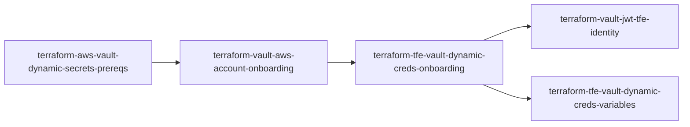

# Terraform Modules for Dynamic AWS Credentials with Vault

This repository contains a collection of Terraform modules designed to streamline the process of setting up and managing dynamic AWS credentials using HashiCorp Vault and Terraform Enterprise/Cloud (TFE/C).

## Module Application Order

The modules should be applied in the following order:

1. **terraform-aws-vault-dynamic-secrets-prereqs:** Configures the necessary prerequisites in AWS and Vault, including an IAM user for Vault, the AWS secrets engine, and the JWT authentication backend.
2. **terraform-vault-aws-account-onboarding:** Onboards target AWS accounts to Vault by creating IAM roles and policies and configuring Vault AWS secret backend roles.
3. **terraform-tfe-vault-dynamic-creds-onboarding:** (Wrapper module) This module simplifies the integration of TFE/C with Vault for dynamic secrets management. It orchestrates the configuration of JWT authentication and environment variables necessary for TFE/C to authenticate with Vault and utilize dynamic AWS credentials. This module calls the following two modules:
    * **terraform-vault-jwt-tfe-identity:** Sets up JWT authentication for TFE/C workload identity.
    * **terraform-tfe-vault-dynamic-creds-variables:** Configures TFE/C environment variables for Vault integration and dynamic AWS credentials.

---

### terraform-aws-vault-dynamic-secrets-prereqs

This module sets up the foundation for secure credential management by:

* Creating an IAM user in AWS with appropriate permissions for Vault integration.
* Configuring the AWS secrets engine in Vault to enable dynamic credential generation.
* Setting up JWT authentication for TFE/C to authenticate with Vault.

**Usage:** Refer to the module's [README](./terraform-aws-vault-dynamic-secrets-prereqs/) for detailed usage instructions and examples.

### terraform-vault-aws-account-onboarding

This module onboards target AWS accounts to Vault by:

* Creating an IAM role in each target account that Vault can assume to generate credentials.
* Defining Vault AWS secret backend roles with appropriate policies to control access to AWS resources.

**Usage:** Refer to the module's [README](./terraform-vault-aws-account-onboarding/) for detailed usage instructions and examples.

### terraform-tfe-vault-dynamic-creds-onboarding

This wrapper module simplifies the integration of TFE/C with Vault by:

* Configuring JWT authentication for TFE/C workload identity.
* Setting up environment variables in TFE/C to enable dynamic credential injection into Terraform providers.

**Usage:** Refer to the module's [README](./terraform-tfe-vault-dynamic-creds-onboarding/) for detailed usage instructions and examples.

### terraform-vault-jwt-tfe-identity

This module configures JWT authentication for TFE/C workload identity by:

* Creating a JWT authentication backend role in Vault.
* Associating the role with specific TFE/C workspaces or projects.
* Defining policies to control access to Vault resources.

**Usage:** Refer to the module's [README](./terraform-vault-jwt-tfe-identity/) for detailed usage instructions and examples.

### terraform-tfe-vault-dynamic-creds-variables

This module configures TFE/C environment variables to enable dynamic credential injection into Terraform providers.

**Usage:** Refer to the module's [README](./terraform-tfe-vault-dynamic-creds-variables/) for detailed usage instructions and examples.

## Module Relationships

