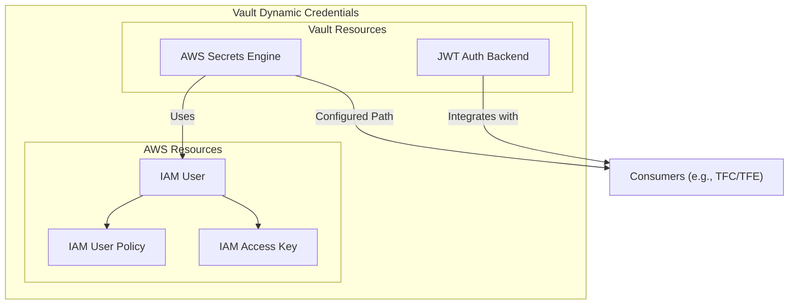
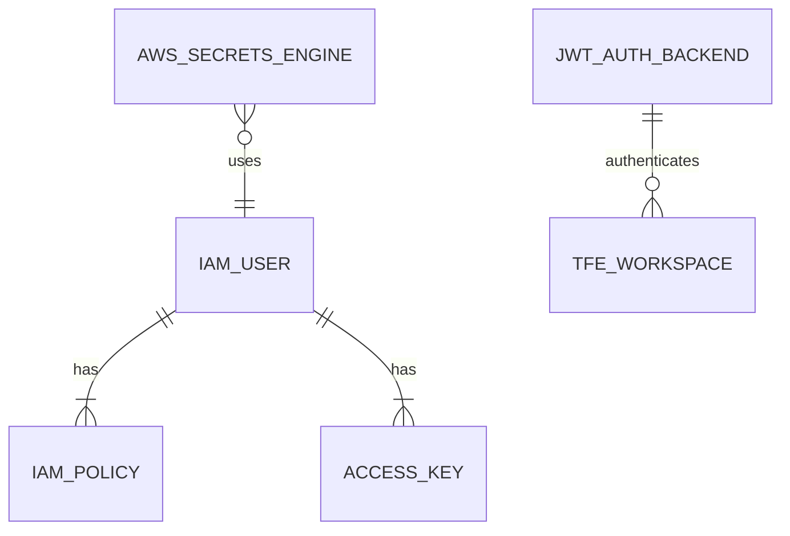

# Terraform AWS Vault Dynamic Credentials Prerequisites

This Terraform module configures the prerequisites for integrating HashiCorp Vault with AWS to enable dynamic credentials provisioning. It provisions IAM resources and Vault backends necessary for secure interaction between Vault and AWS, supporting Terraform Cloud/Enterprise (TFC/TFE) workload identity integration.

## Features

* Creates an AWS IAM user for Vault, with scoped permissions, including `sts:AssumeRole`, for STS role assumptions.
* Configures an IAM user policy to enforce least privilege and secure access.
* Generates IAM access keys for the Vault AWS Secrets Engine and configures the AWS secrets engine with these access keys.
* Sets up the AWS Secrets Engine in Vault for dynamic credentials management.
* Configures the Vault JWT Auth Backend for TFC/TFE integration, enabling secure workload identity.

## Why Use This Module?

This module ensures a standardized, secure, and reusable pattern for integrating Vault with AWS, particularly for TFC/TFE environments. The IAM user and backend configurations are pre-tuned to promote best practices and align with the principle of least privilege. This module sets up the foundation for secure credential management, while downstream modules further enforce the principle of least privilege by configuring specific roles and policies.

## Rotating IAM Access Keys

The Vault AWS Secrets Engine provides the ability to rotate the access keys for the IAM user. This capability ensures the security and longevity of the IAM user credentials. For more information, refer to the [Rotate Root IAM Credentials](https://www.google.com/url?sa=E&source=gmail&q=https://developer.hashicorp.com/vault/api-docs/secret/aws#rotate-root-iam-credentials) documentation. It is **strongly recommended** that automation is configured to rotate the access key based on your organization's security policies. Consider setting up a solution, such as AWS Lambda, to manage access key rotation at a frequency that meets your requirements.

## Visualizations

### Flow Diagram



## Entity Relationship Diagram



## References

Here are key references to better understand the context and capabilities of this module:

* [Why Use Vault-backed Dynamic Credentials?](https://www.hashicorp.com/blog/why-use-vault-backed-dynamic-credentials-to-secure-hcp-terraform-infrastructure)
* [AWS Secrets Engine Documentation](https://developer.hashicorp.com/vault/docs/secrets/aws)
* [Vault JWT Auth Method](https://developer.hashicorp.com/vault/docs/auth/jwt)
* [Workload Identity Overview](https://developer.hashicorp.com/terraform/cloud-docs/workspaces/dynamic-provider-credentials/workload-identity-tokens)
* [Dynamic Provider Credentials Documentation](https://developer.hashicorp.com/terraform/cloud-docs/workspaces/dynamic-provider-credentials)
* [Vault-backed Dynamic Credentials: AWS Configuration](https://developer.hashicorp.com/terraform/cloud-docs/workspaces/dynamic-provider-credentials/vault-backed/aws-configuration)

## License

This project is licensed under the [Apache License 2.0](LICENSE) - see the LICENSE file for details.

---

<!-- BEGIN_TF_DOCS -->

### Providers

| Name | Version |
|------|---------|
| aws | ~> 5.75.1 |
| vault | ~> 4.4.0 |
### Requirements

| Name | Version |
|------|---------|
| terraform | ~> 1.9.8 |
| aws | ~> 5.75.1 |
| vault | ~> 4.4.0 |
### Inputs

| Name | Description | Type | Default |
|------|-------------|------|---------|
| aws_backend_path | The unique path this backend should be mounted at | `string` | `"aws-tfc"` |
| aws_secrets_backend_tune_settings | The settings to tune the AWS secrets backend. | ```object({ default_lease_ttl_seconds = number max_lease_ttl_seconds = number })``` | ```{ "default_lease_ttl_seconds": 3600, "max_lease_ttl_seconds": 7200 }``` |
| external_id | The external ID to use for the IAM role trust policy. | `string` | `null` |
| jwt_backend_path | The unique path this backend should be mounted at. | `string` | `"jwt-tfc"` |
| jwt_backend_tune_settings | The settings to tune the JWT backend. | ```object({ default_lease_ttl = string max_lease_ttl = string token_type = string })``` | ```{ "default_lease_ttl": "1h", "max_lease_ttl": "2h", "token_type": "default-service" }``` |
| oidc_discovery_ca_pem | The CA certificate to use for OIDC discovery. | `string` | `null` |
| region | The AWS region for API calls. | `string` | `"us-east-1"` |
| tags | The tags to apply to the AWS resources. | `map(string)` | `null` |
| tfc_hostname | The hostname of the TFE instance. | `string` | `"app.terraform.io"` |
| vault_service_account_name | The name of the IAM user that Vault will use. | `string` | `"vault-service-account"` |
| vault_service_role_name | The name of the IAM role that Vault will assume. | `string` | `"vault-service-role"` |
### Outputs

| Name | Description |
|------|-------------|
| aws_secret_backend_path | The details of the AWS secrets engine backend. |
| jwt_backend_path | The details of the JWT auth backend. |
| vault_service_account_arn | The ARN of the AWS IAM user that's used by the Vault AWS secrets engine. |
### Resources

| Name | Type |
|------|------|
| [aws_iam_access_key.vault_service_account_key](https://registry.terraform.io/providers/hashicorp/aws/latest/docs/resources/iam_access_key) | resource |
| [aws_iam_user.vault_service_account](https://registry.terraform.io/providers/hashicorp/aws/latest/docs/resources/iam_user) | resource |
| [aws_iam_user_policy.vault_service_account_policy](https://registry.terraform.io/providers/hashicorp/aws/latest/docs/resources/iam_user_policy) | resource |
| [vault_aws_secret_backend.aws_secrets_engine](https://registry.terraform.io/providers/hashicorp/vault/latest/docs/resources/aws_secret_backend) | resource |
| [vault_jwt_auth_backend.tfc_jwt](https://registry.terraform.io/providers/hashicorp/vault/latest/docs/resources/jwt_auth_backend) | resource |
<!-- END_TF_DOCS -->
