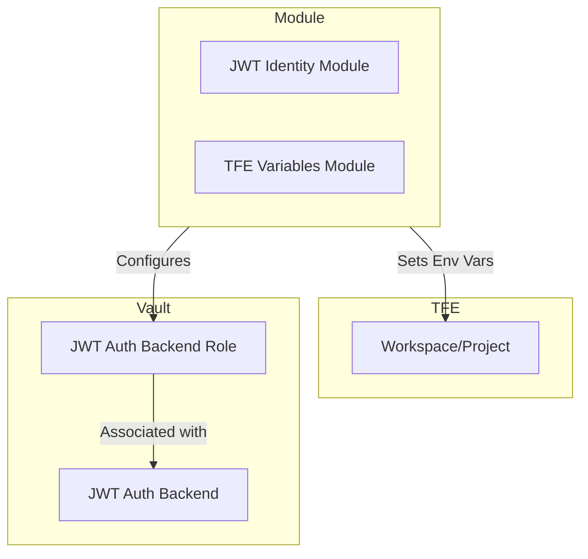
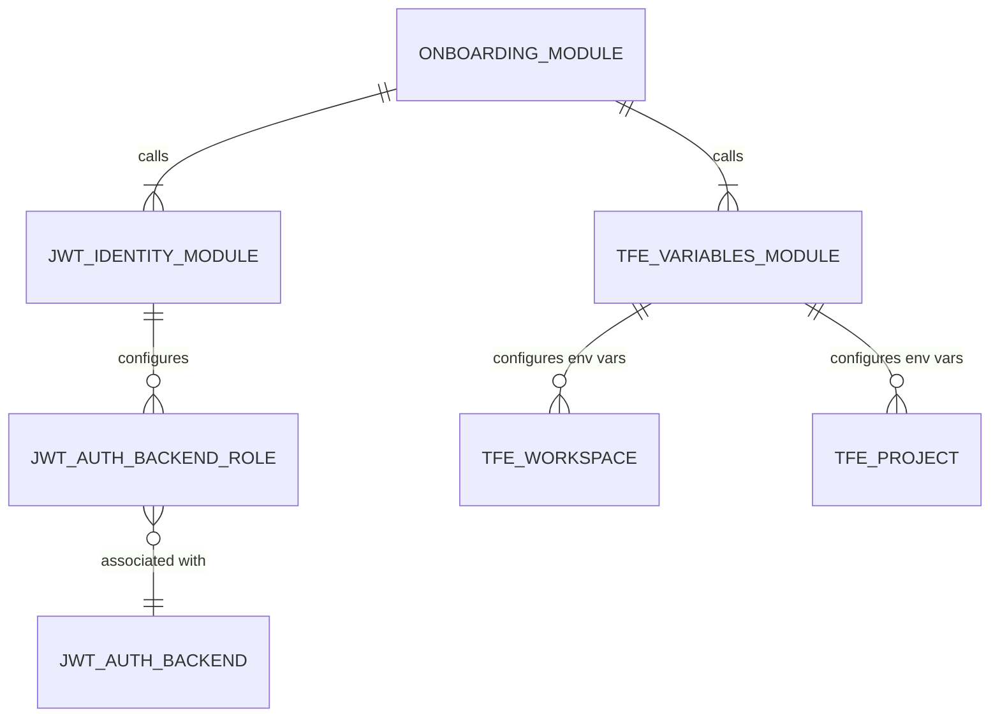

# Terraform TFE Vault Dynamic Credentials Onboarding

This Terraform module streamlines the onboarding of Terraform Enterprise or Cloud (TFE/TFC) Workspaces or Projects to use AWS dynamic credentials from HashiCorp Vault. It combines the functionality of two submodules to configure JWT authentication and set up the necessary environment variables in TFE/TFC.

## Features

* Creates a JWT authentication role in Vault for TFE/TFC Workload Identity.
* Configures TFE environment variables for Vault integration and dynamic AWS credentials.
* Supports multiple Vault AWS roles for projects with multiple aliased AWS providers.
* Simplifies the management of Vault and AWS configurations in TFE/TFC.

## Why Use This Module?

This module simplifies the complex process of integrating TFE/TFC with Vault for dynamic secrets management. It automates the configuration of JWT authentication and environment variables, reducing manual effort and ensuring consistency.

## Visualizations

### Flow Diagram



### Entity Relationship Diagram



## References

Here are key references to better understand the context and capabilities of this module:

* [Why Use Vault-backed Dynamic Credentials?](https://www.hashicorp.com/blog/why-use-vault-backed-dynamic-credentials-to-secure-hcp-terraform-infrastructure)
* [AWS Secrets Engine Documentation](https://developer.hashicorp.com/vault/docs/secrets/aws)
* [Vault JWT Auth Method](https://developer.hashicorp.com/vault/docs/auth/jwt)
* [Workload Identity Overview](https://developer.hashicorp.com/terraform/cloud-docs/workspaces/dynamic-provider-credentials/workload-identity-tokens)
* [Dynamic Provider Credentials Documentation](https://developer.hashicorp.com/terraform/cloud-docs/workspaces/dynamic-provider-credentials)
* [Vault-backed Dynamic Credentials: AWS Configuration](https://developer.hashicorp.com/terraform/cloud-docs/workspaces/dynamic-provider-credentials/vault-backed/aws-configuration)

## License

This project is licensed under the [Apache License 2.0](LICENSE) - see the LICENSE file for details.

---

<!-- BEGIN_TF_DOCS -->

### Providers

| Name | Version |
|------|---------|
| tfe | ~> 0.62.0 |
### Requirements

| Name | Version |
|------|---------|
| terraform | ~> 1.9.8 |
| tfe | ~> 0.62.0 |
| vault | ~> 4.4.0 |
### Modules

| Name | Source | Version |
|------|--------|---------|
| tfc_vault_dynamic_vars | ../terraform-tfe-vault-dynamic-creds-variables | n/a |
| tfc_vault_jwt_identity | ../terraform-vault-jwt-tfe-identity | n/a |
### Inputs

| Name | Description | Type | Default |
|------|-------------|------|---------|
| aws_role_aliases | Collection of AWS dynamic credential aliases. | ```map(object({ tag_suffix = optional(string) aws_run_role_arn = string vault_role = string }))``` | `null` |
| aws_secrets_backend_path | The path to the AWS secrets engine in Vault. | `string` | `null` |
| default_aws_run_role | The default AWS dynamic credential role. | ```object({ aws_run_role_arn = string vault_role = string })``` | `null` |
| tfe_organization_name | The name of your Terraform Enterprise organization | `string` | `null` |
| tfe_project_name | The project under which the workspace resides | `string` | `null` |
| tfe_run_phase | The run phase that the token will be used for | `string` | `"*"` |
| tfe_vault_audience | The audience value to use in run identity tokens | `string` | `"vault.workload.identity"` |
| tfe_workspace_name | The name of the workspace that you'd like to connect with Vault | `string` | `null` |
| vault_address | The URL of the Vault instance you'd like to use with Terraform Enterprise | `string` | `null` |
| vault_base64_pem_ca_certificate | This certificate will be used when connecting to Vault. May be required when connecting to Vault instances that use a custom or self-signed certificate | `string` | `null` |
| vault_custom_jwt_role_policy | The custom policy to use for the JWT role | ```object({ directory = string name = string })``` | `null` |
| vault_jwt_auth_backend_path | The path of the jwt auth backend under which the role will be created | `string` | `null` |
| vault_jwt_role_name_prefix | The prefix that will be used to provide a consistent naming convention to created resources. | `string` | `null` |
| vault_jwt_token_num_uses | The maximum number of times a generated token may be used (within its lifetime); 0 means unlimited | `number` | `0` |
| vault_jwt_token_ttl | The token lifetime in seconds | `number` | `null` |
| vault_namespace | The Vault namespace to use, if not using the default | `string` | `null` |
### Outputs

No outputs.
### Resources

| Name | Type |
|------|------|
| [tfe_project.project](https://registry.terraform.io/providers/hashicorp/tfe/latest/docs/data-sources/project) | data source |
| [tfe_workspace.workspace](https://registry.terraform.io/providers/hashicorp/tfe/latest/docs/data-sources/workspace) | data source |
<!-- END_TF_DOCS -->
