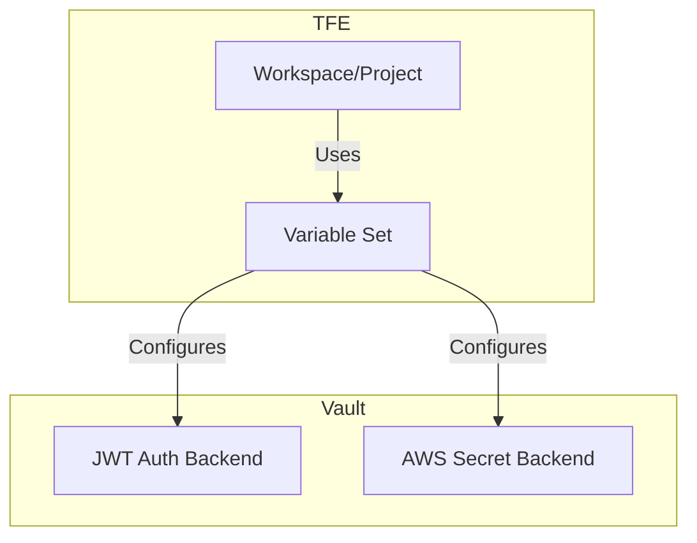
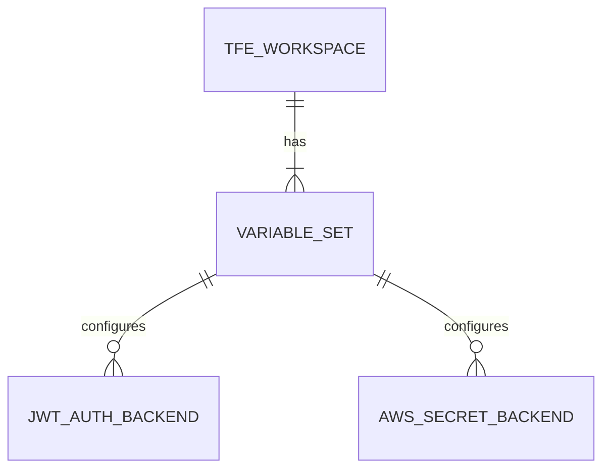

# Terraform TFE Vault Dynamic Credentials Variables

This Terraform module manages environment variables in Terraform Enterprise (TFE) for integrating with HashiCorp Vault and enabling dynamic secrets management. It configures TFE workspaces or projects to authenticate with Vault and utilize dynamic AWS credentials.

## Features

* Creates a variable set in TFE to store Vault-related environment variables.
* Attaches the variable set to specified TFE projects or workspaces.
* Sets up environment variables for JWT authentication with Vault.
* Configures environment variables for AWS dynamic credentials from Vault.
* Supports multiple role tags/aliases for projects with multiple aliased AWS providers.
* Allows customization of Vault and AWS paths and roles.

## Why Use This Module?

This module simplifies the configuration of TFE environment variables for seamless integration with Vault and dynamic AWS credentials. It centralizes the management of sensitive information and promotes consistent configuration across TFE workspaces or projects.

## Visualizations

### Flow Diagram



### Entity Relationship Diagram



## References

Here are key references to better understand the context and capabilities of this module:

* [Why Use Vault-backed Dynamic Credentials?](https://www.hashicorp.com/blog/why-use-vault-backed-dynamic-credentials-to-secure-hcp-terraform-infrastructure)
* [Workload Identity Overview](https://developer.hashicorp.com/terraform/cloud-docs/workspaces/dynamic-provider-credentials/workload-identity-tokens)
* [Dynamic Provider Credentials Documentation](https://developer.hashicorp.com/terraform/cloud-docs/workspaces/dynamic-provider-credentials)
* [Managing Terraform Enterprise Variables](https://developer.hashicorp.com/terraform/enterprise/workspaces/variables/managing-variables)
* [Managing Terraform Enterprise Variable Sets](https://developer.hashicorp.com/terraform/tutorials/cloud/cloud-multiple-variable-sets)
* [Vault-backed Dynamic Credentials: AWS Configuration](https://developer.hashicorp.com/terraform/cloud-docs/workspaces/dynamic-provider-credentials/vault-backed/aws-configuration)

## License

This project is licensed under the [Apache License 2.0](LICENSE) - see the LICENSE file for details.

---

<!-- BEGIN_TF_DOCS -->

### Providers

| Name | Version |
|------|---------|
| tfe | ~> 0.62.0 |
### Requirements

| Name | Version |
|------|---------|
| terraform | ~> 1.9.8 |
| tfe | ~> 0.62.0 |
### Inputs

| Name | Description | Type | Default |
|------|-------------|------|---------|
| aws_role_aliases | Collection of AWS dynamic credential aliases. | ```map(object({ tag_suffix = optional(string) aws_run_role_arn = string vault_role = string }))``` | `null` |
| aws_secret_backend_mount_path | The mount path of the AWS secrets engine in Vault. | `string` | `null` |
| default_aws_run_role | The default AWS dynamic credential role. | ```object({ aws_run_role_arn = string vault_role = string })``` | `null` |
| tfe_organization_name | The name of your Terraform Enterprise organization | `string` | `null` |
| tfe_project_id | The ID of the Terraform Enterprise project you'd like to use with Vault | `string` | `null` |
| tfe_variable_set_name_prefix | The prefix to use for the Terraform Enterprise or Cloud variable set | `string` | `null` |
| tfe_workspace_id | The ID of the Terraform Enterprise workspace you'd like to use with Vault | `string` | `null` |
| vault_address | The URL of the Vault instance you'd like to use with Terraform Enterprise | `string` | `null` |
| vault_base64_pem_ca_certificate | This certificate will be used when connecting to Vault. May be required when connecting to Vault instances that use a custom or self-signed certificate | `string` | `null` |
| vault_jwt_auth_backend_path | The path of the jwt auth backend under which the role will be created | `string` | `null` |
| vault_jwt_auth_backend_role | The name of the Vault role to create for the Terraform Enterprise workspace | `string` | `null` |
| vault_namespace | The Vault namespace to use, if not using the default | `string` | `null` |
### Outputs

No outputs.
### Resources

| Name | Type |
|------|------|
| [tfe_project_variable_set.this](https://registry.terraform.io/providers/hashicorp/tfe/latest/docs/resources/project_variable_set) | resource |
| [tfe_variable.aws_aws_run_role_arn_aliases](https://registry.terraform.io/providers/hashicorp/tfe/latest/docs/resources/variable) | resource |
| [tfe_variable.aws_aws_run_role_arn_aliases_enable](https://registry.terraform.io/providers/hashicorp/tfe/latest/docs/resources/variable) | resource |
| [tfe_variable.aws_secret_backend_auth_type](https://registry.terraform.io/providers/hashicorp/tfe/latest/docs/resources/variable) | resource |
| [tfe_variable.aws_secret_backend_mount_path](https://registry.terraform.io/providers/hashicorp/tfe/latest/docs/resources/variable) | resource |
| [tfe_variable.aws_secret_backend_run_vault_role_aliases](https://registry.terraform.io/providers/hashicorp/tfe/latest/docs/resources/variable) | resource |
| [tfe_variable.default_aws_run_role_arn](https://registry.terraform.io/providers/hashicorp/tfe/latest/docs/resources/variable) | resource |
| [tfe_variable.default_aws_secret_backend_run_vault_role](https://registry.terraform.io/providers/hashicorp/tfe/latest/docs/resources/variable) | resource |
| [tfe_variable.enable_aws_dynamic_credentials](https://registry.terraform.io/providers/hashicorp/tfe/latest/docs/resources/variable) | resource |
| [tfe_variable.enable_vault_provider_auth](https://registry.terraform.io/providers/hashicorp/tfe/latest/docs/resources/variable) | resource |
| [tfe_variable.tfe_vault_addr](https://registry.terraform.io/providers/hashicorp/tfe/latest/docs/resources/variable) | resource |
| [tfe_variable.tfe_vault_encoded_cacert](https://registry.terraform.io/providers/hashicorp/tfe/latest/docs/resources/variable) | resource |
| [tfe_variable.tfe_vault_jwt_auth_backend_path](https://registry.terraform.io/providers/hashicorp/tfe/latest/docs/resources/variable) | resource |
| [tfe_variable.tfe_vault_namespace](https://registry.terraform.io/providers/hashicorp/tfe/latest/docs/resources/variable) | resource |
| [tfe_variable.tfe_vault_role](https://registry.terraform.io/providers/hashicorp/tfe/latest/docs/resources/variable) | resource |
| [tfe_variable_set.this](https://registry.terraform.io/providers/hashicorp/tfe/latest/docs/resources/variable_set) | resource |
| [tfe_workspace_variable_set.this](https://registry.terraform.io/providers/hashicorp/tfe/latest/docs/resources/workspace_variable_set) | resource |
<!-- END_TF_DOCS -->