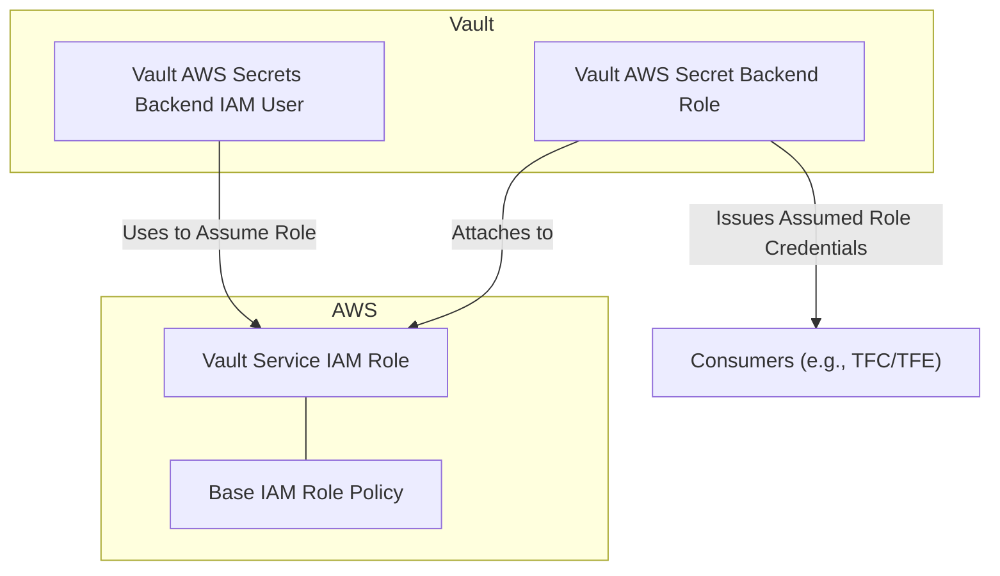
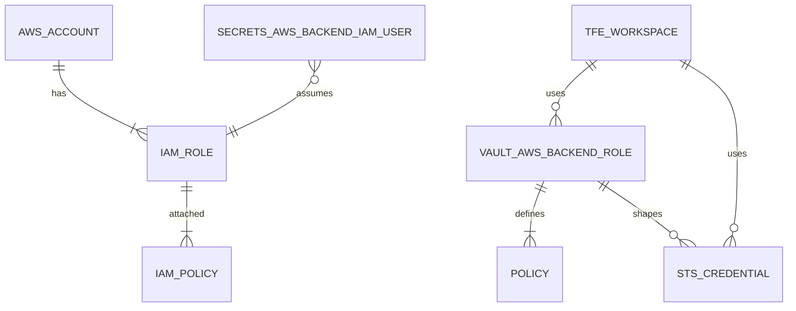

# Terraform Vault AWS Account Onboarding

This Terraform module facilitates the onboarding of AWS accounts into HashiCorp Vault. It provisions the necessary IAM roles, policies, and Vault configurations to securely enable dynamic credential management.

## Features

* Creates an IAM Role with a trust policy for the Vault service user, allowing Vault to assume the role.
* Configures the IAM role policy, which determines the maximum permissions granted to STS credentials issued by Vault. Supports built-in AWS policies or custom JSON policies for maximum flexibility.
* Defines `vault_aws_secret_backend_role` resources to enable Vault to issue `assumed_role` credentials.
* Supports multiple Vault roles using a `for_each` loop for flexible configuration, enabling the definition of various roles with different permissions.

## Why Use This Module?

This module ensures a secure and standardized method for onboarding AWS accounts to Vault. It enforces the principle of least privilege, which means granting only the necessary permissions to perform a specific task, by:

* Restricting IAM role permissions through built-in or custom policies.
* Simplifying the configuration of dynamic AWS credentials with Vault.

By leveraging this module, users can confidently integrate AWS accounts into Vault while adhering to best practices and maintaining operational security.

## Visualizations

### Flow Diagram



### Entity Relationship Diagram



## AWS Session Policy Constraints

### Inline Session Policy Limit

AWS enforces a strict size limit on [session policies](https://docs.aws.amazon.com/transfer/latest/userguide/requirements-roles.html#session-policy):

* **Maximum Size**: The JSON session policy passed during an AssumeRole call cannot exceed `2048` characters.

This limit is fixed and *cannot be increased*.

### Impact

* This limit applies to the serialized policy, including actions, resources, conditions, and structural characters.
* Policies exceeding this size will result in a validation error during the AssumeRole call.

### Important Consideration

If you use a built-in AWS policy that exceeds `2048` characters, it will cause a validation error and fail the session policy application. Users should evaluate the size of their policies, especially when relying on verbose custom policies or large built-in AWS policies.

## References

Here are key references to better understand the context and capabilities of this module:

* [Why Use Vault-backed Dynamic Credentials?](https://www.hashicorp.com/blog/why-use-vault-backed-dynamic-credentials-to-secure-hcp-terraform-infrastructure)
* [Vault AWS Secrets Engine Documentation](https://developer.hashicorp.com/vault/docs/secrets/aws)
* [AWS AssumeRole API](https://docs.aws.amazon.com/STS/latest/APIReference/API_AssumeRole.html)
* [Vault AWS Secrets Backend Roles](https://developer.hashicorp.com/vault/docs/secrets/aws#aws-roles)
* [Dynamic AWS Credentials with Vault](https://developer.hashicorp.com/vault/docs/secrets/aws#dynamic-iam-credentials)

## License

This project is licensed under the [Apache License 2.0](LICENSE) - see the LICENSE file for details.

---

<!-- BEGIN_TF_DOCS -->

### Providers

| Name | Version |
|------|---------|
| aws | ~> 5.75.1 |
| vault | ~> 4.4.0 |
### Requirements

| Name | Version |
|------|---------|
| terraform | ~> 1.9.8 |
| aws | ~> 5.75.1 |
| vault | ~> 4.4.0 |
### Inputs

| Name | Description | Type | Default |
|------|-------------|------|---------|
| aws_secrets_backend_path | The path to the AWS secrets engine in Vault. | `string` | `null` |
| external_id | The external ID to use for the IAM role trust policy. | `string` | `null` |
| tags | The tags to apply to the AWS resources. | `map(string)` | `null` |
| vault_aws_role_configurations | Configuration for various policies, including suffixes, Vault role policy filters, and directories. | ```map(object({ name = string tag_suffix = optional(string) aws_built_in_policy_name = optional(string) custom_policy_name = optional(string) custom_policy_directory = optional(string) default_sts_ttl = optional(number) max_sts_ttl = optional(number) }))``` | ```{ "default_role": { "aws_built_in_policy_name": "ReadOnlyAccess", "custom_policy_directory": null, "custom_policy_name": null, "default_sts_ttl": 3600, "max_sts_ttl": 10800, "name": "assumed-role", "tag_suffix": null } }``` |
| vault_aws_service_role_config | Configuration for the Vault AWS service role. | ```object({ aws_built_in_policy_name = optional(string) custom_policy_name = optional(string) custom_policy_directory = optional(string) })``` | `null` |
| vault_service_role_name | The name of the IAM role that Vault will use. | `string` | `"vault-service-role"` |
| vault_service_user_arn | The ARN of the IAM user that Vault will use. | `string` | `null` |
### Outputs

| Name | Description |
|------|-------------|
| iam_role_arn | The ARN of the created IAM role |
| iam_role_name | The name of the created IAM role |
| policy_arn | The ARN of the policy attached to the IAM role |
| policy_name | The name of the policy attached to the IAM role |
| vault_aws_roles | The Vault AWS roles to be used in the Terraform Cloud Workspace or Project environment variables to support dynamic credentials. |
| vault_aws_secret_backend_role_names | The name of the Vault AWS secret backend role |
### Resources

| Name | Type |
|------|------|
| [aws_iam_policy.custom_policy](https://registry.terraform.io/providers/hashicorp/aws/latest/docs/resources/iam_policy) | resource |
| [aws_iam_role.vault_service_role](https://registry.terraform.io/providers/hashicorp/aws/latest/docs/resources/iam_role) | resource |
| [aws_iam_role_policy_attachment.vault_service_role_policy_attachment](https://registry.terraform.io/providers/hashicorp/aws/latest/docs/resources/iam_role_policy_attachment) | resource |
| [vault_aws_secret_backend_role.dynamic_credentials](https://registry.terraform.io/providers/hashicorp/vault/latest/docs/resources/aws_secret_backend_role) | resource |
| [aws_caller_identity.current](https://registry.terraform.io/providers/hashicorp/aws/latest/docs/data-sources/caller_identity) | data source |
| [aws_iam_policy.built_in_policy_service_role](https://registry.terraform.io/providers/hashicorp/aws/latest/docs/data-sources/iam_policy) | data source |
| [aws_iam_policy.built_in_policy_vault_role](https://registry.terraform.io/providers/hashicorp/aws/latest/docs/data-sources/iam_policy) | data source |
<!-- END_TF_DOCS -->