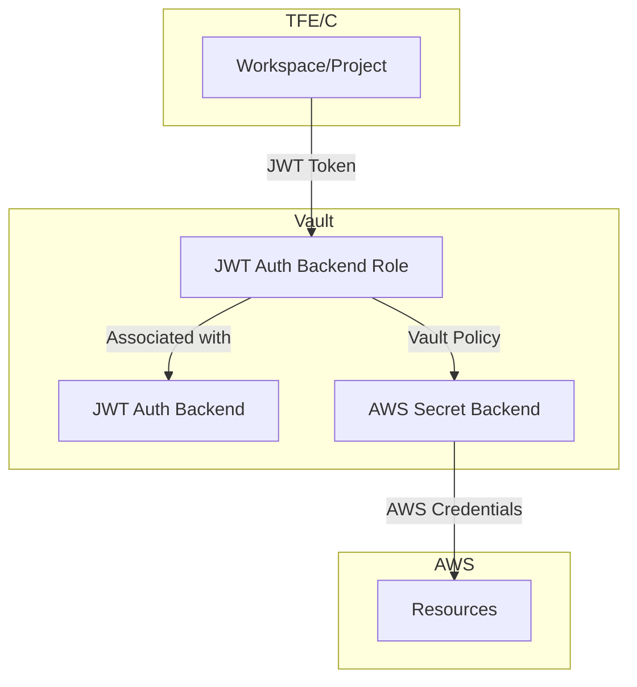
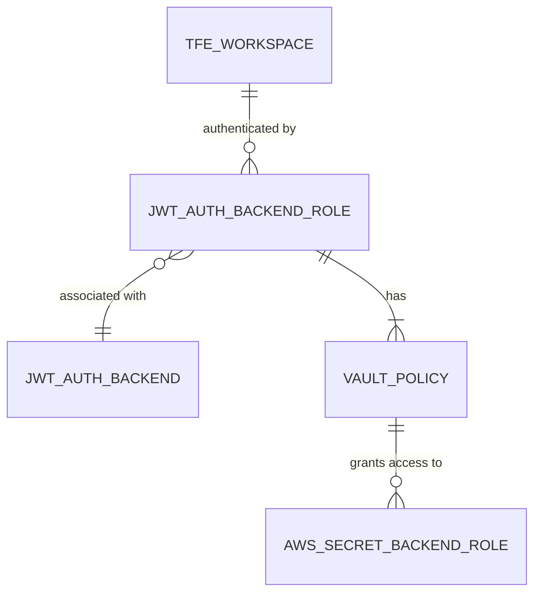

After reviewing the `terraform-vault-jwt-tfe-identity` module, I've identified some areas for improvement in the README. Here's the updated version:

# Terraform Vault JWT TFE Identity

This Terraform module configures JWT authentication in HashiCorp Vault for Terraform Enterprise/Cloud (TFE/C) workload identity. It enables TFE/C workspaces or projects to authenticate with Vault and access secrets, such as dynamic AWS credentials.

## Features

* Configures a Vault JWT authentication backend role and associates it with specified TFE/C workspaces or projects.
* Defines token policies to control TFE/C workspace permissions in Vault, and customizes token settings (TTL, number of uses).
* Utilizes bound claims to restrict authentication to specified TFE/C entities.
* Creates a Vault policy granting access to AWS secrets backend role(s), with optional custom policy for additional permissions.

## Visualizations

### Flow Diagram



### Entity Relationship Diagram



## References

Here are key references to better understand the context and capabilities of this module:

* [Why Use Vault-backed Dynamic Credentials?](https://www.hashicorp.com/blog/why-use-vault-backed-dynamic-credentials-to-secure-hcp-terraform-infrastructure)
* [Vault JWT Auth Method](https://developer.hashicorp.com/vault/docs/auth/jwt)
* [Vault Policies](https://developer.hashicorp.com/vault/docs/concepts/policies)
* [Workload Identity Overview](https://developer.hashicorp.com/terraform/cloud-docs/workspaces/dynamic-provider-credentials/workload-identity-tokens)

## License

This project is licensed under the [Apache License 2.0](LICENSE) - see the LICENSE file for details.

---

<!-- BEGIN_TF_DOCS -->

### Providers

| Name | Version |
|------|---------|
| vault | ~> 4.4.0 |
### Requirements

| Name | Version |
|------|---------|
| terraform | ~> 1.9.8 |
| vault | ~> 4.4.0 |
### Inputs

| Name | Description | Type | Default |
|------|-------------|------|---------|
| aws_secrets_backend_path | The path to the AWS secrets engine in Vault. | `string` | `null` |
| aws_secrets_backend_roles | The list of AWS roles that will be used to generate a Vault policy for the JWT role | `list(string)` | `null` |
| jwt_auth_backend_path | The path of the jwt auth backend under which the role will be created | `string` | `null` |
| name_prefix | The prefix that will be used to provide a consistent naming convention to created resources. | `string` | `null` |
| tfe_organization_name | The name of your Terraform Enterprise organization | `string` | `null` |
| tfe_project_name | The project under which the workspace resides | `string` | `null` |
| tfe_run_phase | The run phase that the token will be used for | `string` | `"*"` |
| tfe_vault_audience | The audience value to use in run identity tokens | `string` | `"vault.workload.identity"` |
| tfe_workspace_name | The name of the workspace that you'd like to connect with Vault | `string` | `null` |
| token_num_uses | The maximum number of times a generated token may be used (within its lifetime); 0 means unlimited | `number` | `0` |
| token_ttl | The token lifetime in seconds | `number` | `null` |
| vault_custom_jwt_role_policy | The custom policy to be attached to the JWT role | ```object({ name = string directory = string })``` | `null` |
### Outputs

| Name | Description |
|------|-------------|
| token_policies | The policies that are attached to the role in Vault |
| vault_jwt_workload_identity_role | The role that's created in Vault for the TFE Workspace or Project |
### Resources

| Name | Type |
|------|------|
| [vault_jwt_auth_backend_role.tfe_role](https://registry.terraform.io/providers/hashicorp/vault/latest/docs/resources/jwt_auth_backend_role) | resource |
| [vault_policy.policy](https://registry.terraform.io/providers/hashicorp/vault/latest/docs/resources/policy) | resource |
<!-- END_TF_DOCS -->